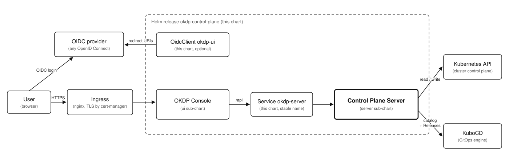

<p align="center">
  <a href="https://okdp.io">
    
  </a>
</p>

[](https://github.com/OKDP/okdp-control-plane-charts/actions/workflows/ci.yml)
[](https://github.com/OKDP/okdp-control-plane-charts/actions/workflows/release-please.yml)
[](http://www.apache.org/licenses/LICENSE-2.0)

# OKDP Control Plane Charts

Helm chart deploying the OKDP control plane as a whole: the API server
([okdp-control-plane-server](https://github.com/OKDP/okdp-control-plane-server)) and the web
console ([okdp-control-plane-ui](https://github.com/OKDP/okdp-control-plane-ui)), wired together
with the platform (in-cluster API Service, ingress, and optionally the OIDC client).

---

## Why this project

Each control-plane component ships its own Helm chart, released and published with the
component (`oci://quay.io/okdp/charts/okdp-control-plane-server`, `oci://quay.io/okdp/charts/okdp-control-plane-ui`).
Deploying the control plane then means installing two charts, keeping their versions aligned,
pointing the console at the right API Service and registering the console with the platform
OIDC provider by hand.

This repository provides a single chart, `okdp-control-plane`, that installs both components
in one release with the platform glue between them, and pins the pair of versions validated
together.

---

## What the project does

- **Helm chart `okdp-control-plane`** (`charts/okdp-control-plane/`): umbrella chart depending
  on the published `okdp-control-plane-server` and `okdp-control-plane-ui` charts, plus:
  - a stable `okdp-server` Service in front of the API server pods, so the console `/api`
    routing does not depend on the Helm release name;
  - optionally, the console's OIDC client created as a Kubernetes resource
    (`oidcClient.enabled`, off by default), for providers that register clients that way;
  - a `helm test` pod checking the health endpoints of both components.
- **OCI package** `oci://quay.io/okdp/charts/okdp-control-plane`, published on release.

<!-- release-please rewrites the first version of each line in the block below,
     so the chart version has to come before the sub-chart versions on its row. -->
<!-- x-release-please-start-version -->
| Chart | Version | Control plane (`appVersion`) | Sub-charts |
|---|---|---|---|
| [`okdp-control-plane`](charts/okdp-control-plane) | `0.2.0` | `0.7.x` | `okdp-control-plane-server` 0.7.1, `okdp-control-plane-ui` 0.7.0 |
<!-- x-release-please-end -->

Repository layout:

- `charts/okdp-control-plane`: the chart (`Chart.yaml`, `values.yaml`, `templates/`, `ci/`).
- `docs/assets`: architecture diagram (`architecture.drawio`, `architecture.svg`).
- `.github/workflows`: CI, publish and release workflows.
- `.ct.yml`, `.ct-install.yml`, `.lintconf.yaml`: chart-testing and yamllint configuration.
- `release-please-config.json`, `.release-please-manifest.json`: release automation.

---

## Architecture

<p align="center">
  
</p>

> **OKDP deployment context:** the chart installs the console and the API server **in the
> same release**. The browser only talks to the console origin: the console image serves the
> static bundle and the ingress routes `/api` to the in-cluster `okdp-server` Service, so no CORS
> is involved between the console and the API. The browser does call the OIDC provider directly
> to load its configuration, which that provider must allow.
>
> The platform provides the ingress controller, cert-manager, the OIDC provider and the GitOps
> engine (KuboCD). The chart renders the Ingress of the console; the console's OIDC client is
> registered in that provider (see Requirements).

See the sub-chart repositories for the internals of each component, and the
[KuboCD documentation](https://github.com/kubotal/kubocd) for the `Context` and `Release`
model the server builds on.

---

## Requirements

To install the chart:

- a Kubernetes cluster, and [Helm](https://helm.sh/) >= 3.8 (OCI registries).
- an OIDC provider — Keycloak, Dex, or any OpenID Connect one. Set its issuer URL in `okdp-control-plane-ui.oidc.authority`, and register a
  client (`okdp-control-plane-ui.oidc.clientId`) with the console as an allowed redirect URI — see
  [Registering the console client](#registering-the-console-client). The chart assumes no provider
  and, by default, creates no client.

For the control plane to work once installed:

- [KuboCD](https://github.com/kubotal/kubocd) and a `Context` holding the service catalog: the
  server reads the catalog from that `Context` and creates the `Release` resources KuboCD
  reconciles. Without it the pods start and the console loads, but the catalog is empty and no
  service can be deployed.
- an ingress controller (`nginx` by default) and cert-manager with the ClusterIssuer named in
  `okdp-control-plane-ui.ingress.clusterIssuer`.
- an OIDC provider that allows the console origin, since the browser loads its configuration
  directly; otherwise sign-in does nothing.
- metrics-server (optional, resource usage panels of the console).

Sign-in is the standard OpenID Connect authorization-code flow with PKCE: the login, the catalog
and the services behave the same on any provider. The one provider-dependent feature is the
console's Identity pages (users and groups), which need a provider that exposes user and group
management to the platform; with any other provider the section stays hidden.

Known-good baseline: chart `0.2.0` <!-- x-release-please-version -->
with `okdp-control-plane-server` `0.7.1` and `okdp-control-plane-ui` `0.7.0`, on a Kind cluster.
This is the version set validated by the maintainers; the OKDP sandbox runs the same console
against Keycloak.

### Toolchain tested

| Tool | Version |
|---|---|
| Helm | `3.18` |
| Kind | `0.27.0` |
| kubectl | `1.32.2` |
| chart-testing | `3.14` |

---

## Installation

Install the chart from the OKDP registry, with the host the console is served on and the issuer
of your OIDC provider:

<!-- x-release-please-start-version -->
```sh
helm install okdp-control-plane oci://quay.io/okdp/charts/okdp-control-plane --version 0.2.0 \
  -n okdp-system --create-namespace \
  --set okdp-control-plane-ui.ingress.host=console.example.com \
  --set okdp-control-plane-ui.oidc.authority=https://oidc.example.com
```
<!-- x-release-please-end -->

### Registering the console client

`oidc.authority` has no default: the render fails without it rather than pointing the console at
someone else's issuer. In your OIDC provider, register the client `okdp-ui` with three redirect
URIs — `https://<ingress host>`, `https://<ingress host>/` and
`https://<ingress host>/silent-refresh.html` — and the same URL as post-logout redirect.

Some providers register OIDC clients as Kubernetes resources; for those, `--set
oidcClient.enabled=true` has the chart create the console's client for you (it needs the provider's
client CRD on the cluster).

Once the pods are `Running`, check the release; the install notes print the console URL:

```sh
kubectl get pods -n okdp-system -l app.kubernetes.io/instance=okdp-control-plane
helm test okdp-control-plane -n okdp-system
```

### On the OKDP dev sandbox

The values matching the [dev sandbox](https://github.com/OKDP/okdp-control-plane-dev-sandbox)
ship with the chart, from a checkout of this repository:

```sh
helm dependency update charts/okdp-control-plane
helm install okdp-control-plane charts/okdp-control-plane -n okdp-system --create-namespace \
  -f charts/okdp-control-plane/values-dev-sandbox.yaml
```

That file also carries the `kubectl patch` the sandbox needs to let its OIDC provider answer the
console origin, without which sign-in does nothing.

### Upgrading from 0.2.0

The defaults no longer target the dev sandbox, so a release installed on 0.2.0 defaults must now
pass `-f values-dev-sandbox.yaml`, or set the same values. Upgrading without them deletes the
OIDC client the release owned, which unregisters the console with the provider, and moves the
ingress host, the KuboCD `Context` and the admin role to neutral defaults.

---

## Cleanup

Remove the Helm release, and the namespace if it was created only for this install:

```sh
helm uninstall okdp-control-plane -n okdp-system
kubectl delete namespace okdp-system
```

---

## Development

Clone the repository, resolve the sub-charts and install from the local checkout:

```sh
git clone https://github.com/OKDP/okdp-control-plane-charts.git
cd okdp-control-plane-charts
helm dependency update charts/okdp-control-plane
helm install okdp-control-plane charts/okdp-control-plane -n okdp-system --create-namespace \
  --set okdp-control-plane-ui.ingress.host=console.example.com \
  --set okdp-control-plane-ui.oidc.authority=https://oidc.example.com
```

Lint and test the chart the way CI does:

```sh
helm lint charts/okdp-control-plane -f charts/okdp-control-plane/values-dev-sandbox.yaml
ct lint --config .ct.yml --all --check-version-increment=false
kind create cluster && ct install --config .ct-install.yml --namespace default
helm-docs -c .
```

`ct install` uses the values in `charts/okdp-control-plane/ci/`, which only carry an issuer URL:
no OIDC provider runs on a bare cluster, and the console sub-chart requires one.

Developing the console against that cluster (`npm start` on `localhost:4200`) needs the local
origins as redirect URIs on the client. `values-dev-sandbox.yaml` already lists them; with
another provider, add them there.

### Upgrade the control-plane version

The chart pins the sub-chart versions in `Chart.yaml` (`dependencies[].version`) and
`appVersion`. To ship a new control-plane release, bump them, run
`helm dependency update charts/okdp-control-plane`, commit `Chart.lock` and open a pull request
with a conventional commit message (`feat: ...`); release-please proposes the chart version bump.

---

## Configuration

All values of the sub-charts are exposed under the `okdp-control-plane-server:` and
`okdp-control-plane-ui:` keys; the most common ones are listed in
[values.yaml](charts/okdp-control-plane/values.yaml) and every value is documented in the
[chart README](charts/okdp-control-plane/README.md). The values a deployment usually sets:

| Value | Default | Description |
|---|---|---|
| `okdp-control-plane-ui.oidc.authority` | *(required)* | Issuer URL of the OIDC provider the console authenticates against |
| `okdp-control-plane-ui.oidc.clientId` | `okdp-ui` | Client id the console uses, which must exist in that provider |
| `okdp-control-plane-ui.ingress.host` | `okdp-ui.example.com` | Public host of the console |
| `okdp-control-plane-ui.ingress.clusterIssuer` | `default-issuer` | cert-manager ClusterIssuer of the console certificate |
| `okdp-control-plane-ui.backend.service` | `okdp-server` | Name of the stable Service rendered in front of the API server pods |
| `okdp-control-plane-server.configuration.*` | see values | Server environment (platform namespace, KuboCD context, log level, ...) |
| `oidcClient.enabled` | `false` | Have the chart create the console's OIDC client as a Kubernetes resource; needs the provider's client CRD |
| `oidcClient.extraRedirectURIs` | `[]` | Extra redirect URIs on that client (console development) |

Values for the OKDP dev sandbox live in
[values-dev-sandbox.yaml](charts/okdp-control-plane/values-dev-sandbox.yaml) rather than in the
defaults, so the chart targets no particular platform.

---

## Contributing & License

Contributions follow the [OKDP contribution guide](https://github.com/OKDP/.github/blob/main/CONTRIBUTING.md). Released under the [Apache License 2.0](LICENSE).

---

**Built 🚀 for the OKDP Community**
<a href="https://okdp.io">
  
</a>
